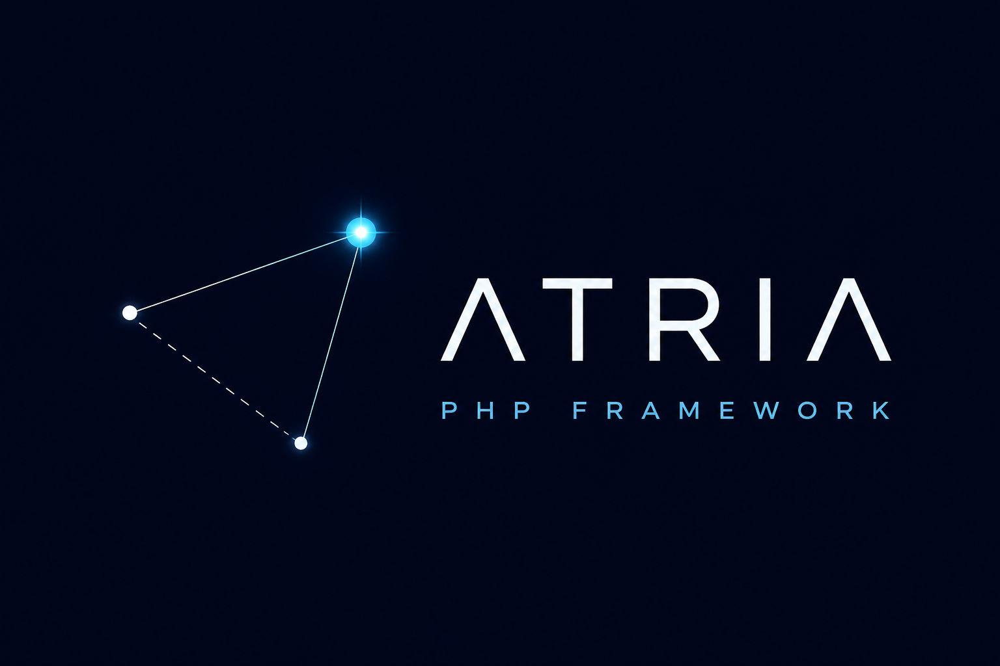

  

# Atria Core

Atria Core is the PHP runtime behind the Atria framework. It provides HTTP routing,
dependency injection, configuration, PostgreSQL migrations, auth, CSRF, views, Vite,
Mercure, and FrankenPHP Go extension sources.

## Developer Documentation

Technical documentation for framework contributors is available in [`docs/00-index.md`](docs/00-index.md):

- [Architecture](docs/01-architecture.md)
- [Runtime Lifecycle](docs/02-runtime-lifecycle.md)
- [Built-in Modules](docs/03-modules.md)
- [Contributing](docs/04-contributing.md)

## Requirements

- PHP 8.4 or newer

## Development

See the [contribution guide](docs/04-contributing.md) for the complete development workflow,
including integration validation with the sibling Atria application.
